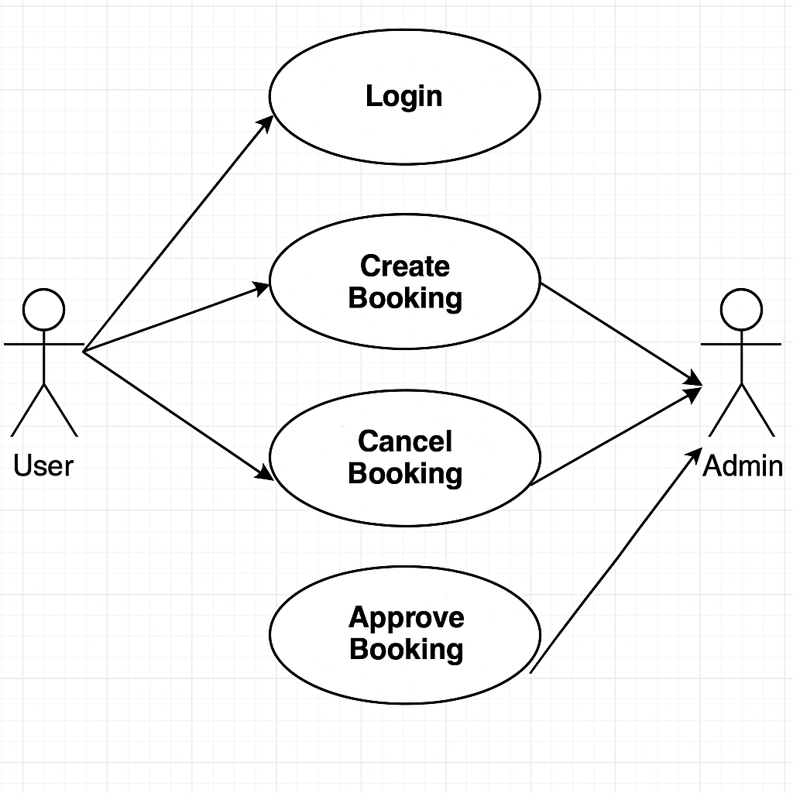

## Requirement-analysis

## Requirement Analysis in Software Development

This repository is dedicated to exploring the concept of Requirement Analysis in the Software Development Lifecycle (SDLC). It includes theoretical explanations, practical examples, and visual aids to help understand and apply requirement analysis techniques effectively in software projects.

## What is Requirement Analysis?

Requirement Analysis is a critical phase in the Software Development Lifecycle (SDLC) where the needs and conditions of the stakeholders are identified, analyzed, documented, and validated. It helps ensure that the final software product meets the user's expectations and business objectives.

During this phase, developers, business analysts, and stakeholders work collaboratively to define what the system should do, how it should perform, and under what conditions it will operate. It provides a clear roadmap for developers and reduces the risk of project failure.

## Why is Requirement Analysis Important?

- **Reduces Development Errors**: Properly defined requirements help in avoiding misunderstandings and mistakes during development.
- **Improves Customer Satisfaction**: When requirements are well-understood and documented, the final product aligns more closely with user needs.
- **Saves Time and Resources**: Identifying issues early prevents costly rework later in the project.

## Key Activities in Requirement Analysis

- **Requirement Gathering**: Collecting initial requirements from stakeholders through interviews, surveys, and observations.
- **Requirement Elicitation**: Deep diving into stakeholders’ needs using techniques such as brainstorming, workshops, and use cases.
- **Requirement Documentation**: Recording the requirements clearly and systematically in requirement specification documents.
- **Requirement Analysis and Modeling**: Evaluating requirements for clarity, completeness, and feasibility, and creating models such as flowcharts or use case diagrams.
- **Requirement Validation**: Ensuring that requirements are accurately captured and meet the stakeholder’s expectations through reviews and testing.

## Types of Requirements

### Functional Requirements

Functional requirements describe what the system should do.

Examples for the booking management project:
- Users can create and manage bookings.
- Admin can approve or reject bookings.
- The system sends confirmation emails upon booking.

### Non-functional Requirements

Non-functional requirements define how the system performs.

Examples for the booking management project:
- The system should handle up to 500 simultaneous bookings.
- Booking confirmation emails should be sent within 2 minutes.
- The platform should be accessible 99.9% of the time.
## Types of Requirements

### Functional Requirements

Functional requirements describe what the system should do.

Examples for the booking management project:
- Users can create and manage bookings.
- Admin can approve or reject bookings.
- The system sends confirmation emails upon booking.

### Non-functional Requirements

Non-functional requirements define how the system performs.

Examples for the booking management project:
- The system should handle up to 500 simultaneous bookings.
- Booking confirmation emails should be sent within 2 minutes.
- The platform should be accessible 99.9% of the time.

## Use Case Diagrams

Use Case Diagrams visually represent system functionalities and the interactions between users (actors) and these functionalities (use cases). They help identify key requirements and ensure complete system understanding.

